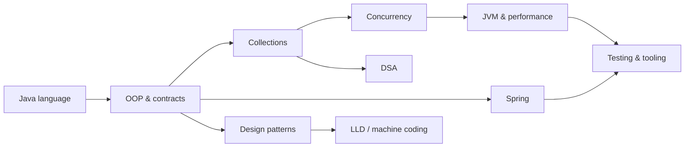

# Java Knowledge Vault

> Senior-level Java engineering vault centered on **Java 25 LTS**, modern JVM practices, Spring, concurrency, DSA, design, testing, and machine coding.

## Learning Spine

**Understand → Implement → Measure → Break → Explain → Review**

The vault is not a collection of reference pages. Every important topic should end with working code, a failure mode, a trade-off, and an explanation that can be delivered without the note open.

### Decision Ladder

Use the least complicated mechanism that satisfies the requirement:

**Language feature → Standard library → Library/framework → Concurrency abstraction → Framework infrastructure → Distributed-system pattern**

Do not add a framework, abstraction, thread pool, reactive pipeline, or design pattern unless it solves a concrete problem.

---

## Navigation

| Domain | Purpose |
|---|---|
| 00 · Java & LTS Overview | Java 8→25 evolution, current Java 25 LTS, roadmap, interview strategy |
| 01 · Core Java | Language fundamentals, types, generics, exceptions, streams, I/O, JPMS |
| 02 · OOP & Design Principles | OOP, SOLID, object relationships, maintainability |
| 03 · Collections | Collection contracts, implementations, ordering, complexity, modern APIs |
| 04 · Concurrency | Threads, executors, futures, locks, atomics, virtual threads |
| 05 · Spring | Spring Framework, Boot, MVC, Data, transactions, security, Spring AI |
| 06 · Design Patterns | GoF patterns plus practical enterprise patterns |
| 07 · DSA | Data structures and algorithms implemented in Java |
| 08 · Modern Java | Java 9→25 language/library/runtime evolution |
| 09 · Java 21 Deep Dive | Java 21 LTS features and migration reference; not a second primary roadmap |
| 10 · LLD & Machine Coding | Requirements, object design, UML, state, concurrency and implementation |
| 11 · JVM & Performance | GC, JIT, diagnostics, profiling, memory and production troubleshooting |
| 12 · Testing & Tooling | JUnit, Mockito, Testcontainers, Maven/Gradle and engineering feedback loops |
| 99 · Revision | Study plan, interview bank, spaced repetition and mock practice |

---

## How the Domains Fit



### Primary path

**Core Java → OOP → Collections → Concurrency → JVM → Spring → Testing → Patterns → LLD**

### Parallel practice

- **DSA + Coding Patterns**: solve problems using the Java implementations in DSA and the repository's [[Coding Patterns/README|Coding Patterns]] domain.
- **Modern Java**: learn features when they solve a real language, API, concurrency, or runtime problem.
- **Revision**: use Study Plan continuously rather than waiting until the end.

---

## Java Version Strategy

**Java 25 is the primary target because it is the current LTS.** Java 21 remains important because it introduced virtual threads, sequenced collections, record patterns, and pattern matching for switch. Java 17 is the compatibility baseline for many existing enterprise systems.

Keep historical LTS material as **migration knowledge**, not as three separate curricula.

### Java 25 focus

- Scoped Values — final
- Compact Object Headers — product feature
- Flexible Constructor Bodies — final
- Module Import Declarations — final
- Compact Source Files and Instance Main Methods — final
- Primitive Types in Patterns — preview
- Structured Concurrency — preview
- Stable Values — preview

Preview APIs and language features must be explicitly marked and compiled with the matching preview flags.

---

## Mastery Evidence

A topic is complete only when the note contains enough evidence to answer:

1. **Problem** — what problem exists?
2. **Mechanism** — what invariant or runtime behavior solves it?
3. **Implementation** — can I write the smallest useful example?
4. **Trade-off** — what does this cost?
5. **Failure mode** — how does it break?
6. **Measurement** — what would I measure in production?
7. **Alternative** — when should I choose something else?
8. **Interview explanation** — can I explain it from memory?

---

## Plugin Responsibilities

- **Dataview** — progress, indexes, review queues and stale-note reporting.
- **Tasks** — concrete practice actions; do not use Dataview as a task manager.
- **Templater** — note scaffolding and dates.
- **Excalidraw** — architecture, lifecycle, concurrency and state diagrams where a visual adds information.
- **Mermaid** — small inline diagrams; use Excalidraw for diagrams that need exploration or manual editing.

---

## Quality Rules

- Use vault-relative wikilinks such as `Core Java`.
- Do not use `../...` links.
- Avoid aliased wikilinks inside Markdown tables when a plain link is sufficient.
- Every code example must be syntactically plausible and identify its required Java release/preview status.
- Do not present benchmark numbers without a workload and measurement method.
- Distinguish **language feature**, **library API**, **JVM implementation detail**, and **framework behavior**.
- Fast-changing framework/version claims must include the relevant version/date.
- Prefer one canonical note per concept; use related links instead of duplicating explanations.
- Do not turn every note into flashcards. Keep only questions that test a meaningful invariant or decision.
- Remove generic filler such as “FAANG interview” claims unless the note contains a concrete senior-level question.
- Keep READMEs as navigation/MOC pages; keep technical explanations in topic notes.

---

## Progress

```dataview
TABLE WITHOUT ID
  file.link AS "Note",
  category AS "Category",
  choice(completed, "✅", "⬜") AS "Done",
  difficulty AS "Difficulty",
  reviewed AS "Reviewed",
  "sr-due" AS "Due"
FROM "Java"
WHERE category AND file.name != "README" AND type != "template"
SORT "sr-due" ASC
```

## Review Queue

```tasks
not done
path includes Java
sort by due
limit 30
```

## Related Vaults

- [[Coding Patterns/README|Coding Patterns]] — problem-solving patterns
- [[Architect/README|Architect]] — system design and architecture
- [[AI/README|AI]] — AI engineering and enterprise AI

---

*Java Knowledge Vault · Java 25 LTS · maintained as an engineering reference and practice system*


## Knowledge System Integration

- [[00 - Knowledge System/README|Knowledge System]] — shared learning model
- [[Evidence/README|Evidence]] — implementations, benchmarks and failures
- [[Build Lab/README|Build Lab]] — portfolio systems
