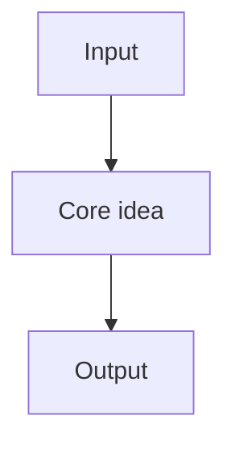

# <% Tp.file.title %>

> Part of [[README|Java MOC]] • `<% tp.file.folder().split("/").pop() %>`

> [!tip] How to use this note
> - Press `Ctrl/Cmd + P` → `Templater: Replace templates` if prompts appear.
> - Tick `completed` above when done. Set `reviewed` date to feed the MOC progress bars.
> - Flashcards at the bottom use Spaced Repetition (`#flashcard`). Review with `Ctrl/Cmd + P` → `Spaced Repetition: Review flashcards`.
> - Random pick: `Ctrl/Cmd + P` → `Open random note`.

## Why it Matters

One paragraph. Define the **key term** once in bold, then state where it shows up in interviews or real code.

## Diagram



## Operations , Complexity

| Operation | Cost | Notes |
|---|---|---|
| | | |

## When to use / not

| Use | NOT |
|-----|-----|
| | |

## Code

```java
// Why this snippet matters in one line
record Demo(String name) {}
```

## Vs

| | A | B |
|--|---|---|
| Invariant | | |
| Use | | |

## Java 25 Notes

- Record, pattern matching, or virtual thread angle if relevant. Else delete this section.

## Pitfalls

- One concrete mistake per line with the fix.

## Interview q&a

**Q1. ?**
Answer in 2 sentences.

**Q2. ?**
Answer in 2 sentences.

Q1 without number prefix?: answer condensed to one line. #flashcard
Q2 without number prefix?: answer condensed to one line. #flashcard

> SR format is `Question:: answer #flashcard` on one line. Keep each card factual and short.

## Practice Tasks

- [ ] Restate the intent from memory ⏳ <% tp.date.now("YYYY-MM-DD", 1) %>
- [ ] Code the snippet without looking ⏳ <% tp.date.now("YYYY-MM-DD", 3) %>
- [ ] Answer both Q&A aloud ⏳ <% tp.date.now("YYYY-MM-DD", 7) %>
```tasks
not done
path includes <% tp.file.folder() %>
sort by due
limit 10
```

## Related

- [[README|Java MOC]]
- [[ ]]

---
*Category: <% tp.file.folder().split("/").pop() %> • Part of [[README|Java MOC]]*
