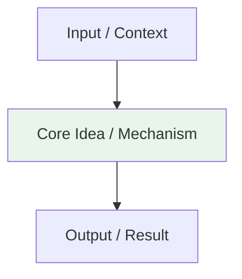

# {{title}}

> Part of [[README|Java MOC]] • `{{category}}`
> 🎨 **Visual diagram:** Create Excalidraw drawing from template: `Cmd+P → Excalidraw: New from template → Java Diagram`

## Intent
One sentence: what problem does this solve? Define the **key term** in **bold**.

## Why it Matters
- Where this appears in interviews (FAANG, senior vs. junior)
- Production impact (performance, correctness, maintainability)
- Senior signal: recognizing the *disguised* form of this concept

## Diagram


## Code / Example
```java
// Java 25: var, record, pattern matching for instanceof, SequencedCollection, virtual threads, Compact Object Headers
// Core template for {{title}}

record {{title.replace(/\s+/g, '')}}(/* params */) {
    static {{title.replace(/\s+/g, '')}} of(/* params */) {
        // build logic
        return new {{title.replace(/\s+/g, '')}}(/* args */);
    }
    
    /* returnType */ keyMethod(/* params */) {
        // O(1) or O(n) logic
    }
}

// Example usage
void example() {
    var instance = {{title.replace(/\s+/g, '')}}.of(/* args */);
    var result = instance.keyMethod(/* args */);
}
```

### Concrete Example
- **Input:** 
- **Output:** 
- **Explanation:** 

## When to Use / When NOT
| **Use When** | **Avoid When** |
|--------------|----------------|
| - Trigger keywords: | - Over-engineering simple cases |
| - Constraints: | - Premature optimization |
| - Pattern signature: | - When standard library suffices |

## Trade-offs
| Dimension | This Approach | Alternative |
|-----------|---------------|-------------|
| Complexity | | |
| Performance | | |
| Readability | | |
| Testability | | |

## Vs Table
| Aspect | This | Alternative | Decision Rule |
|--------|------|-------------|---------------|
| | | | |

## Pitfalls
- Common mistake 1 → Fix
- Common mistake 2 → Fix

## Interview Q&A (Senior Depth)

**Q1. What is the core insight of this concept, and why does it work?**
**A:** In 2–3 sentences. Connect the *why* to the language/runtime invariant.

**Q2. When would you choose an alternative over this concept?**
**A:** Cite concrete constraints and name the alternative.

**Q3. How does this change with virtual threads / Project Loom?**
**A:** Explain the impact on concurrency model.

**Q4. Walk me through a non-obvious problem that reduces to this concept.**
**A:** Describe the reduction step-by-step.

**Q5. What is the memory/performance implication at scale?**
**A:** Discuss heap, GC, JIT interaction.

## Flashcards (Spaced Repetition)

#flashcard
**Q:** What is the trigger keyword for {{title}}? :: **A:** [trigger keywords] #flashcard

#flashcard
**Q:** Time/space complexity of {{title}}? :: **A:** Time: O(), Space: O() #flashcard

#flashcard
**Q:** When do you NOT use {{title}}? :: **A:** [anti-pattern scenarios] #flashcard

#flashcard
**Q:** Core Java 25 snippet for {{title}}? :: **A:** `record ... { static of(...) {} keyMethod() {} }` #flashcard

## Practice Tasks (Tasks Plugin)
- [ ] Restate the intent from memory 📅 {{date:YYYY-MM-DD, +1}}
- [ ] Code the snippet without looking 📅 {{date:YYYY-MM-DD, +3}}
- [ ] Answer all Interview Q&A aloud 📅 {{date:YYYY-MM-DD, +7}}
- [ ] Review flashcards (Spaced Repetition) 📅 {{date:YYYY-MM-DD, +1}}

```tasks
not done
path includes {{file.folder}}
sort by due
limit 10
```

## Related
- [[README|Java MOC]]
- [[{{file.folder}}/README|{{file.folder.split('/').pop()}} Folder]]

---

*Category: {{category}} • Part of [[README|Java MOC]] • Java 25*