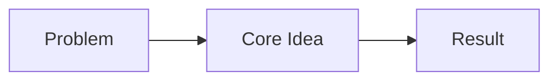

# {{title}}

> Part of [[README|MOC]] • `{{category}}`

## Intent
One line: what problem this solves / why it exists in the vault.

## Why it Matters
- Senior framing: the constraint, trade-off, or architectural force.
- Common misconceptions this note corrects.

## Diagram


## Code / Example
```java
// 5-10 line runnable Java 25 snippet — the artifact you can whiteboard
```

## When to Use / When NOT
- **Use:** concrete trigger (e.g., "many range sum queries on immutable array")
- **NOT:** anti-pattern trigger (e.g., "array updates interleaved with queries → use Segment Tree")

## Trade-offs
| Dimension | This Approach | Alternative |
|-----------|---------------|-------------|
| Time      |               |             |
| Space     |               |             |
| Updates   |               |             |

## Vs Table
| Aspect | This | Alternative | Decision Rule |
|--------|------|-------------|---------------|
|        |      |             |               |

## Pitfalls
- Trap 1 (what juniors do)
- Trap 2 (what looks right but fails under load)

## Interview Q&A (3-5 questions, senior depth)
**Q:** [Killer question] **A:** [Answer with artifact + metric + rejected alternative]
**Q:** [Follow-up probe] **A:** [Mechanism + threshold where it flips]
**Q:** [Edge case / scaling] **A:** [Concrete boundary + fallback]

## Related
- [[Note]] · [[Note]]

---
*Category: {{category}}*